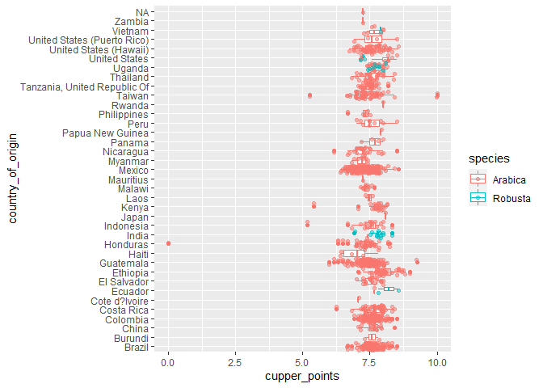
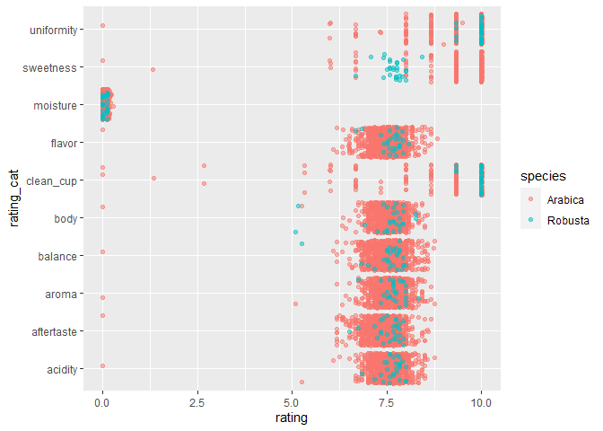

Trial Publishing RMarkdown to Github
================
2022-08-05

## R Markdown

This is an R Markdown document. Markdown is a simple formatting syntax
for authoring HTML, PDF, and MS Word documents. For more details on
using R Markdown see <http://rmarkdown.rstudio.com>.

When you click the **Knit** button a document will be generated that
includes both content as well as the output of any embedded R code
chunks within the document. You can embed an R code chunk like this:

``` r
summary(cars)
```

    ##      speed           dist       
    ##  Min.   : 4.0   Min.   :  2.00  
    ##  1st Qu.:12.0   1st Qu.: 26.00  
    ##  Median :15.0   Median : 36.00  
    ##  Mean   :15.4   Mean   : 42.98  
    ##  3rd Qu.:19.0   3rd Qu.: 56.00  
    ##  Max.   :25.0   Max.   :120.00

## Including Plots

You can also embed plots, for example:

<!-- -->

Note that the `echo = FALSE` parameter was added to the code chunk to
prevent printing of the R code that generated the plot.

    ## ── Attaching packages ─────────────────────────────────────── tidyverse 1.3.2 ──
    ## ✔ ggplot2 3.3.6     ✔ purrr   0.3.4
    ## ✔ tibble  3.1.8     ✔ dplyr   1.0.9
    ## ✔ tidyr   1.2.0     ✔ stringr 1.4.0
    ## ✔ readr   2.1.2     ✔ forcats 0.5.1
    ## ── Conflicts ────────────────────────────────────────── tidyverse_conflicts() ──
    ## ✖ dplyr::filter() masks stats::filter()
    ## ✖ dplyr::lag()    masks stats::lag()
    ## 
    ## Attaching package: 'scales'
    ## 
    ## 
    ## The following object is masked from 'package:purrr':
    ## 
    ##     discard
    ## 
    ## 
    ## The following object is masked from 'package:readr':
    ## 
    ##     col_factor

    ## Rows: 1339 Columns: 43
    ## ── Column specification ────────────────────────────────────────────────────────
    ## Delimiter: ","
    ## chr (24): species, owner, country_of_origin, farm_name, lot_number, mill, ic...
    ## dbl (19): total_cup_points, number_of_bags, aroma, flavor, aftertaste, acidi...
    ## 
    ## ℹ Use `spec()` to retrieve the full column specification for this data.
    ## ℹ Specify the column types or set `show_col_types = FALSE` to quiet this message.

``` r
coffee_ratings %>% 
  group_by(country_of_origin) %>% 
  ggplot(aes(cupper_points, country_of_origin, color = species))+
  geom_boxplot()+
  geom_jitter(alpha = 0.5)
```

<!-- -->

``` r
coffee_longer <- coffee_ratings %>% 
  pivot_longer(cols = c(aroma:sweetness, "moisture"), names_to = "rating_cat", values_to = "rating")
```

<!-- -->
